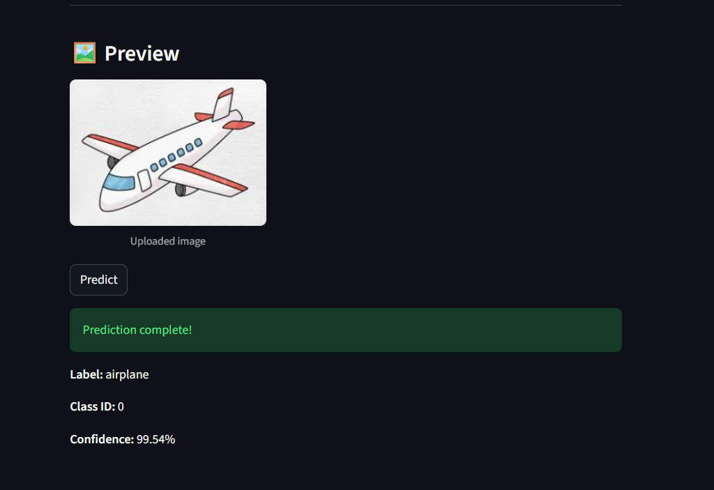
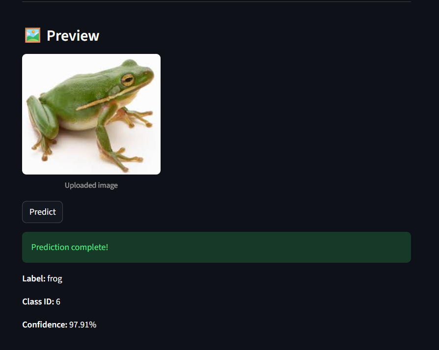

# ML Framework Lab: CIFAR-10 Image Classification Pipeline

This project demonstrates a complete Deep Learning workflow, emphasizing an isolated and reproducible environment using `uv` and modular PyTorch architecture.

## 🎯 Purpose
The goal of this lab is to demonstrate how modern tools can be used to create a consistent, reproducible environment and a modular pipeline for machine learning development.

## 🛠️ Tools and Technologies

- **Python** (Managed via `uv`)
- **PyTorch** (Core Deep Learning framework)
- **Pytorch Lightning** (High-level interface for modular PyTorch development)
- **DVC** (Data Version Control for AWS S3)
- **Scikit-learn & Pandas** (Data processing and environment verification)
- **Jupyter Notebook** (For EDA)

```text
ML-Framework-Lab/
├── .dvc/
├── .venv/
├── data/
│   ├── cifar-10-batches-py/
│   └── cifar-10-batches-py.dvc
├── Deploy/
├── models/                  
│   ├── model.onnx
│   └── model.onnx.data
├── ML_lab/
│   └── check_env.py
├── src/
│   ├── dataset.py
│   ├── constants.py
│   ├── EDA.ipynb
│   └── model.py
├── test_images/
├── pages/                   
│   └── Predict.py        
├── Predictions/   
├── docker-compose.yml       
├── Dockerfile               
├── Dockerfile.streamlit     
├── .dockerignore
├── .gitignore
├── streamlit_app.py         
├── app.py     
├── download_testimage.py
├── export.py
├── main.py  
├── model.onnx.dvc
├── model.pth
├── .dvcignore             
├── pyproject.toml
├── README.md
├── uv.lock
└── verify_onnx.py               

```

🏗️ Project Architecture Update
To improve modularity and adhere to the principle of Boilerplate Reduction, we refactored the pipeline from vanilla PyTorch to PyTorch Lightning. In this professional architecture, the manual loops and evaluation logic previously found in `train.py` were integrated directly into the `LightningModule` methods (`training_step`, `validation_step`, `test_step`) within src/model.py. This makes the codebase significantly easier to maintain and scale.

## Performance Impact:
 Transitioning to the Lightning framework resulted in a test accuracy of 66.54% for the primary experiment (exp1), a notable improvement over the initial vanilla implementation.


## 🛠️ Task 0: Environment Verification & GPU Setup
Before building the pipeline, We developed a verification script to ensure hardware acceleration and dependency integrity. 

**Key Features:**

* **Hardware Detection:** Identifies CUDA availability for modern architectures.
* **Tensor Benchmark:** Performs a 1000 x 1000 matrix multiplication to verify compute functionality.
* **Version Auditing:** Reports exact versions for Python, Torch, Scikit-learn, and Pandas.

**GPU / CUDA Support (RTX 50-series)**

On my machine (RTX 50-series), standard PyTorch builds did not support the new architecture. We configured pyproject.toml to use the CUDA 12.8 test wheel index to enable GPU support:
https://download.pytorch.org/whl/test/cu128

To verify your environment:

```bash
uv sync
uv run python ML_lab/check_env.py
```
---

## 📊 Task 1: Experiments & Results

We optimized the pipeline with BatchNorm and improved normalization, leading to a new performance baseline:

| Experiment | Name | Learning Rate | Batch Size | Test Accuracy |
| :--- | :--- | :--- | :--- | :--- |
| 01 | exp1 | 0.001 | 64 | 73.85% |
| 02 | exp2 | 0.01 | 64 | 64.48% |
| 03 | exp3 | 0.001 | 128 | 73.79% |

### ⚠️Note: 

Final accuracy results may vary slightly across different runs due to stochastic weight initialization and data shuffling, which is typical for Deep Learning pipelines.

## 👥 Collaborators

- Lilit 
- Josefin 

### Project Progression
We initiated the project with Josefin forking the repository to test model exporting via **TorchScript**. Lilit created a separate branch to explore **ONNX**. Our goal was to evaluate both formats to determine which model offered the best performance and integration for our pipeline.

After consulting with our instructor, we decided to streamline our workflow by deleting the fork and working directly from a cloned version of the main repository. We ultimately chose to move forward exclusively with **ONNX** and transitioned to a continuous update model using feature branches and peer reviews.

### Analysis

* Convergence Failure: In `exp2`, a learning rate of 0.01 was too high for the Adam optimizer, preventing the model from converging and resulting in random-chance accuracy (~10%).

* Batch Size: Increasing the batch size to 128 (`exp3`) slightly reduced the learning progress compared to 64 within the same 3-epoch window.

* Reproducibility: All experiments are automated and can be triggered via:

```bash
uv run python main.py
```

## 📦 Data Version Control (DVC)
Raw data is stored in an AWS S3 bucket and tracked via `.dvc` files to keep the Git repository lightweight.

* Setup: To fetch the dataset after cloning, run: 

```bash
dvc pull
```
### ⚠️ Note on Data Access
The raw data is managed via DVC and stored in a private AWS S3 bucket. If you do not have access to the remote storage, you can download the data directly via PyTorch by following these steps:

1. Open `src/dataset.py`.
2. Locate the `CIFAR10` dataset initialization.
3. Temporarily change `download=False` to `download=True`.
4. Run `main.py` once to download the dataset to the `data/` folder.
5. Change it back to `download=False` to maintain the pipeline integrity.

We have used this same method to initially fetch and then version-control the data with DVC.

## 🚀 Task 2: Model Deployment
We have successfully exported the best-performing model to the ONNX format for cross-platform inference.

## Model Export & Verification

* **Format**: ONNX (Open Neural Network Exchange).

* **Verification**: Passed via `verify_onnx.py`(Output matches PyTorch results).

* **Storage**: Large model weights (.onnx and .onnx.data) are tracked via DVC to keep the Git history lightweight.


*Figure 1: Successful backend inference showing the ONNX model correctly classifying a test image via the FastAPI endpoint.*


*Figure 2: Successful backend inference showing the ONNX model correctly classifying a test image via the FastAPI endpoint.*

## Modern Deployment Stack

* **Backend**: FastAPI service optimized for high-performance inference and automated documentation.

* **Frontend**: Streamlit dashboard providing an intuitive interface for non-technical users.

* **Containerization**: Fully dockerized environment using Docker Compose for seamless, one-command setup.

### To use the model, run:

```bash
dvc pull model.onnx.dvc
uv run python verify_onnx.py
```
## 💻 Running the Application
To run the entire system (API + UI) without manual installation:

1. **Pull the model**: 
   ```bash
   dvc pull
    ```

2. **Launch containers**:
 ```bash
   docker-compose up --build
```

3. **API Documentation**: Once the containers are running, you can access the interactive Swagger UI at [http://localhost:8000/docs](http://localhost:8000/docs) to test the endpoints manually.


### 🔧 Bug Fix & Optimization Log

During the deployment phase, we identified and resolved a critical "Inference Gap" where the model predicted with only 10% accuracy in the API despite high training results:
* **Weight Persistence:** Fixed a bug where `model.pth` wasn't being updated after training.
* **Preprocessing Alignment:** Synchronized the FastAPI preprocessing (normalization and tensor shapes) to match the training pipeline exactly.

### 🖥️ Task 3: Interactive Dashboard (Frontend)
We developed a custom web interface to make the model accessible to non-technical users.

* **Framework**: Built with **Streamlit** for a reactive and Python-native UI.
* **Multi-Page Architecture**: Organized with a **Home Dashboard** for project info and a **Predict Page** for model interaction.
* **Custom Styling**: Implemented **CSS injection** to create a professional "LAB NAVIGATION" sidebar.
* **Real-Time Monitoring**: Integrated a **System Status** module that pings the FastAPI backend.
* **User-Centric Design**: Optimized for a **compact and wide layout**, ensuring all category information is visible without scrolling.

## ✍️ Reflection

During this project, we learned how important it is to have a correctly configured and reproducible development environment. A major challenge was installing PyTorch with GPU support, as my RTX 50-series GPU required a test build with CUDA 12.8. This helped me understand how hardware and software compatibility affects machine learning workflows.

The verification script was kept intentionally simple to ensure clear failures if the environment is incorrect, making problems easier to detect. Solving the hardware alignment issues and modularizing the code into src/ provided deep insight into professional dependency management and troubleshooting in ML environments.

### Streamlit Web Interface

This project includes a Streamlit web interface that allows users to interact with the CIFAR-10 image classifier in a simple graphical UI.

The interface lets users:
Upload an image (png, jpg, jpeg)
Send the image to the FastAPI inference API
View the predicted class and confidence score
Perform a health check to verify that the backend API is running

The Streamlit app acts as the frontend layer of the system, communicating with the backend through HTTP requests.

Features:
Image upload and preview
Prediction request to FastAPI /predict
Confidence visualization with a progress bar
Emoji mapping for CIFAR-10 classes
API health check in the sidebar
Model information display

## 🔗 Pull Requests & Code Reviews
To satisfy the collaboration requirement, these links document our peer reviews and technical fixes:

https://github.com/LAjoyan/ML-Framework-lab/pull/11 : Collaborative cross-environment documentation.
https://github.com/LAjoyan/ML-Framework-lab/pull/19 : Graphical Interface & Layout Optimization.
